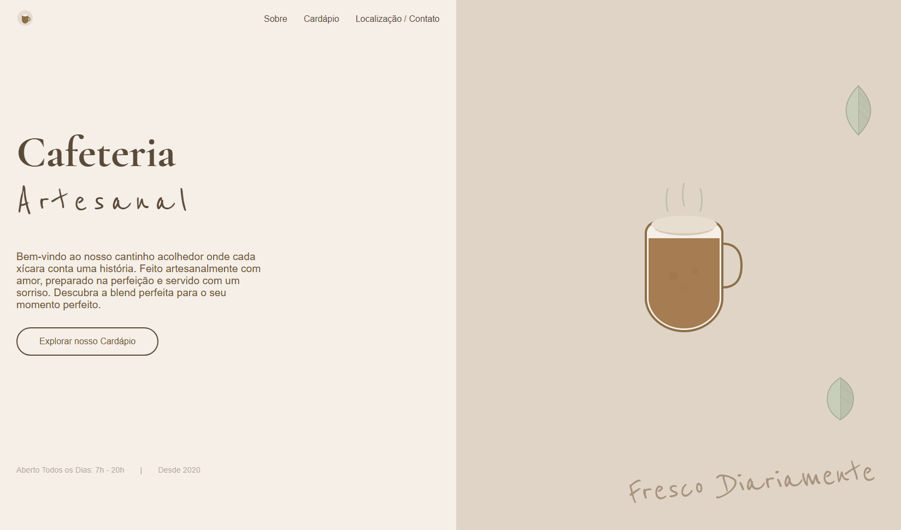
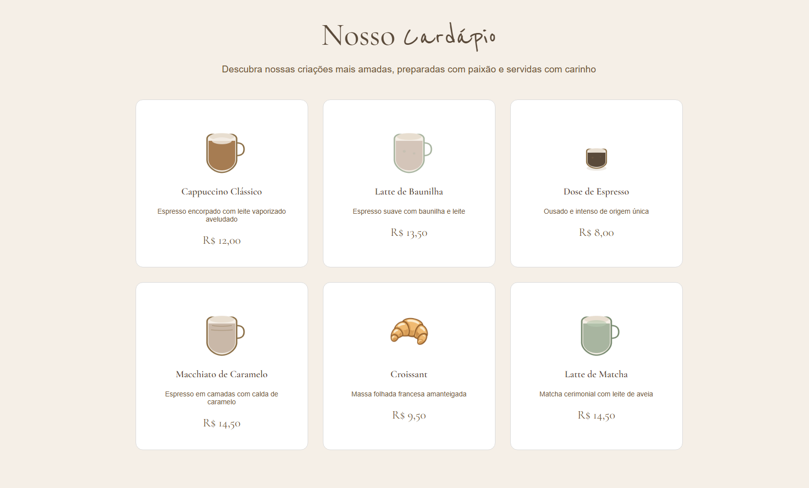
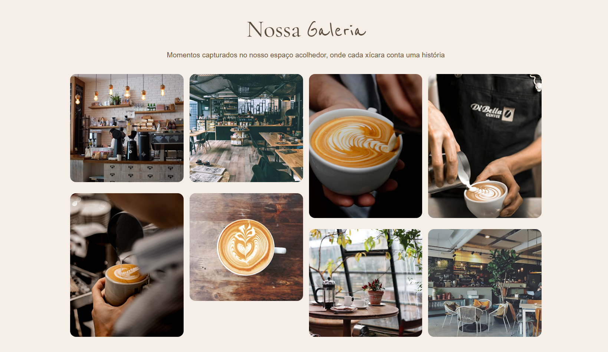
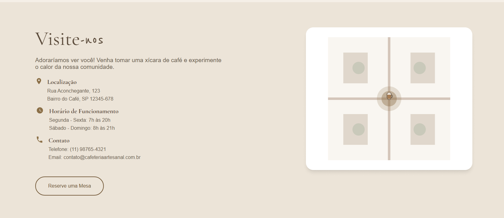

<div align="center">


# Cafeteria Artesanal

Landing page responsiva para uma cafeteria fictícia, feita com HTML e CSS puros.


</div>

---

## Sobre o projeto

A **Cafeteria Artesanal** é uma landing page criada para praticar desenvolvimento front-end: transformar uma identidade visual em código, montar layouts com Flexbox e Grid e adaptar tudo para diferentes tamanhos de tela.

> **Projeto fictício.** A cafeteria, o endereço, o telefone, o e-mail e as redes sociais não existem. Por isso alguns links e botões (como "Reserve uma Mesa") são apenas ilustrativos.


### Seções

| Início | Cardápio |
|:---:|:---:|
|  |  |

| Galeria | Visite-nos |
|:---:|:---:|
|  |  |


## Seções da página

- **Início:** apresentação da cafeteria, menu de navegação e chamada para o cardápio.
- **Sobre nós:** história e valores do estabelecimento.
- **Cardápio:** seis itens com imagem, descrição e preço.
- **Por que nos escolher:** três diferenciais (grãos frescos, embalagens sustentáveis e receitas artesanais).
- **Galeria:** mosaico de fotos do espaço e das bebidas.
- **Visite-nos:** endereço, horários e contato.
- **Rodapé:** links rápidos, redes sociais e informações legais.

## O que foi praticado

- **HTML semântico:** `main`, `nav`, `section` e `footer`, com âncoras para navegar entre as seções.
- **CSS Custom Properties:** cores e fontes centralizadas em variáveis no `:root`.
- **Flexbox:** alinhamento do cabeçalho, da seção inicial, do "Sobre" e dos blocos de contato.
- **CSS Grid:** cardápio (3, 2 ou 1 colunas), "Por que nos escolher" e rodapé com `grid-template-areas`.
- **Colunas CSS (`column-count`):** galeria em estilo mosaico.
- **Media queries:** ajustes em `1070px` e `750px`.
- **Transições e hover:** botões, links e cards do cardápio.
- **Rolagem suave** entre as seções.
- **Google Fonts:** combinação de fonte serifada (títulos) com fonte manuscrita (detalhes).

## Paleta de cores

| Cor | Hex | Uso |
|:---:|:---:|---|
|  | `#5a4a3a` | Títulos e elementos principais |
|  | `#8b6f47` | Textos secundários, preços e botões |
|  | `#6b5d4f` | Textos de apoio |
|  | `#f5efe7` | Fundo claro |
|  | `#ece4d8` | Fundo de contraste |

## Tipografia

- **Cormorant Garamond:** títulos e nomes dos itens.
- **Reenie Beanie:** detalhes manuscritos.

## Estrutura de pastas

```text
.
├── index.html
├── styles.css
├── favicon.svg
├── favicon.ico
├── apple-touch-icon.png
├── README.md
└── assets/
    ├── images/          # imagens do site
    └── prints/     # prints usados neste README
```

## Como executar

Não é preciso instalar nada.

```bash
# 1. Clone o repositório
git clone https://github.com/SEU-USUARIO/NOME-DO-REPOSITORIO.git

# 2. Entre na pasta
cd NOME-DO-REPOSITORIO

# 3. Abra o index.html no navegador
```

Se preferir, use a extensão **Live Server** do VS Code para recarregar a página automaticamente durante a edição.

## Autor

**Kaique Martins**

[GitHub](https://github.com/kaiquedevjs) · [LinkedIn](https://www.linkedin.com/in/kaique-de-oliveira-martins/)

## Licença

Este projeto foi criado para fins de estudo. Sinta-se à vontade para usar como referência.
